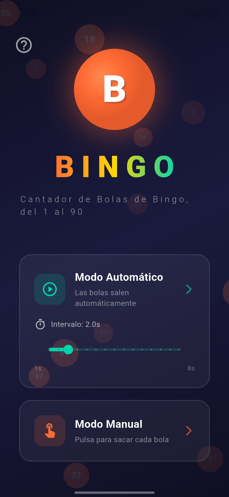
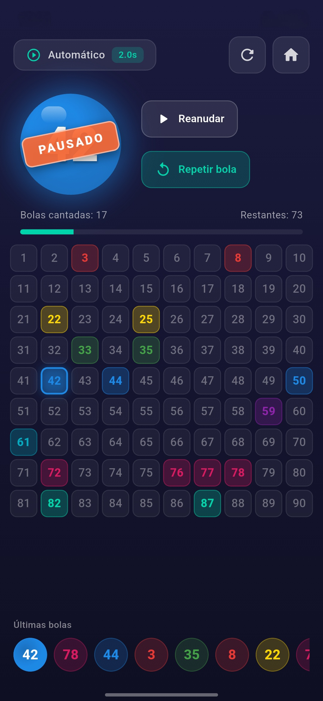
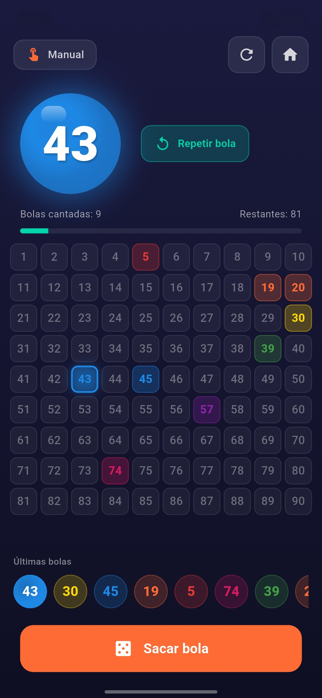

# ¡Cantador de Bolas de Bingo!


<p align="center">
  
</p>

¡Bienvenido al **Cantador de Bolas de Bingo**! Una aplicación moderna, limpia y funcional diseñada para cantar los números del clásico Bingo (del 1 al 90) directamente desde tu teléfono móvil.

<p align="center">
  
  
  
</p>

## ✨ Características Principales

* **🎲 Dos modos de juego:**
  * **Automático:** Elige un intervalo de tiempo (de 1 a 8 segundos) y relájate. Las bolas saldrán y se cantarán solas.
  * **Manual:** Toma el control total. Toca la pantalla para sacar y cantar la siguiente bola a tu ritmo.
* **🗣️ Voz incorporada:** Cada bola extraída es anunciada en voz alta automáticamente para que nadie se pierda ningún número.
* **⏸️ Sistema de Pausa Dinámico:** Puedes pausar el modo automático en cualquier momento sin perder de vista el tablero y pedir que se repita la última bola cantada.
* **📊 Historial en pantalla:** Un tablero completo que se va iluminando para saber exactamente qué bolas han salido, junto con un historial rápido de las últimas extracciones.
* **🎨 Interfaz Accesible:** Diseño cuidado con colores vibrantes, animaciones fluidas y una experiencia visual atractiva.

## 🚀 Cómo empezar (Instalación)

Si quieres compilar el proyecto en tu propio ordenador:

1. Asegúrate de tener instalado [Flutter](https://flutter.dev/).
2. Clona este repositorio:
   ```bash
   git clone https://github.com/andrea-ivanov/Cantador-de-Bingo.git
   ```
3. Entra en el directorio del proyecto:
   ```bash
   cd Cantador-de-Bingo
   ```
4. Instala las dependencias:
   ```bash
   flutter pub get
   ```
5. Ejecuta la aplicación:
   ```bash
   flutter run
   ```

*(Nota: Para generar un archivo instalable en Android `.apk`, ejecuta `flutter build apk --release` y transfiérelo a tu teléfono).*

## 👩‍💻 Autora

Creado y diseñado por **Andrea Ivanov**.
Versión actual: `1.1.0`
